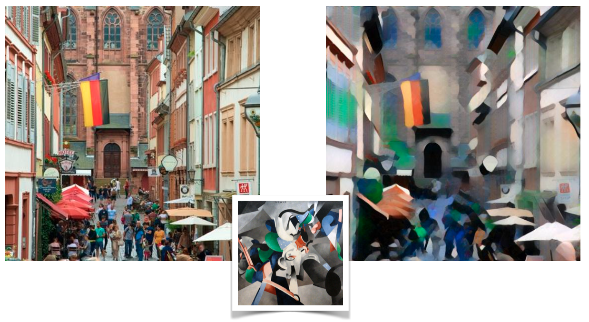

# styleTransferNeuronSegment
In this work I'll try to see if I can enhance Neuron Segmentation with producing images of the train set with different styles. A full report of the work can be found "[here](https://github.com/ahmadnish/styleTransferNeuronSegment/blob/master/tex/report.pdf)".

## Setup

This code is based on torch.

Dependencies:
* [pytorch](https://pytorch.org) 
* [Nifty](https://github.com/DerThorsten/nifty)
* [NumPy](https://github.com/numpy/numpy/blob/master/INSTALL.rst.txt)
* [SciPy](https://github.com/scipy/scipy/blob/master/INSTALL.rst.txt)
* [Pillow](http://pillow.readthedocs.io/en/3.3.x/installation.html#installation)

## Examples

### Artistic Style Transfer

